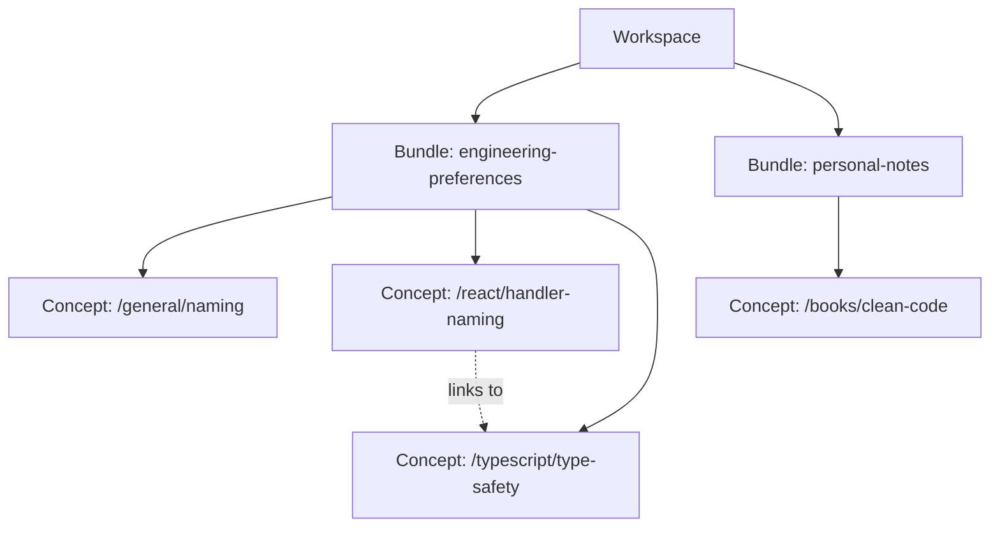
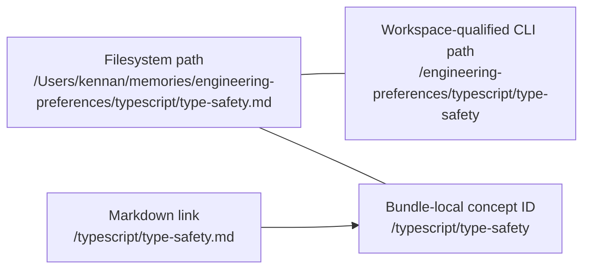

# Building Blocks and Connections

## High-level structure



```text
Workspace
│
├── Bundle: engineering-preferences
│   ├── index.md
│   ├── Concept: /general/naming
│   ├── Concept: /react/handler-naming
│   └── Concept: /typescript/type-safety
│
└── Bundle: personal-notes
    ├── index.md
    └── Concept: /books/clean-code
```

## 1. Workspace

A workspace is a directory containing one or more bundles. It is a `manly` organizational concept, not necessarily part of the OKF specification.

```text
memories/                     <- workspace root
├── engineering-preferences/  <- bundle
└── personal-notes/           <- bundle
```

A workspace provides:

```text
Workspace
├── filesystem root
├── bundle discovery
├── bundle selection
└── workspace-wide commands
    ├── list
    ├── search
    └── check
```

The workspace itself does not own concepts directly:

```text
Workspace
    owns Bundles
        own Concepts
```

Possible Go representation:

```text
Workspace
├── Root
└── Bundles
```

## 2. Bundle

A bundle is a self-contained OKF knowledge collection.

```text
engineering-preferences/
├── index.md
├── general/
│   ├── index.md
│   └── naming.md
├── react/
│   └── handler-naming.md
└── typescript/
    └── type-safety.md
```

A bundle provides:

```text
Bundle
├── identity
│   └── engineering-preferences
├── root directory
├── root index.md
├── metadata
│   ├── okf_version
│   ├── type: Bundle
│   └── title
├── concepts
├── directory indexes
└── internal links
```

The root `index.md` identifies and describes the bundle:

```text
engineering-preferences/index.md
```

It may contain bundle frontmatter:

```yaml
---
okf_version: "0.1"
type: Bundle
title: Engineering Preferences
---
```

Nested `index.md` files organize directories:

```text
engineering-preferences/react/index.md
```

They are not bundle roots and must not contain bundle frontmatter.

## 3. Concept

A concept is one unit of knowledge represented by one Markdown file.

```text
engineering-preferences/react/handler-naming.md
```

It contains:

```text
Concept
├── metadata
│   ├── type
│   ├── title
│   ├── description
│   ├── tags
│   └── timestamp
├── Markdown body
└── links to other concepts
```

Example:

```markdown
---
type: React Guideline
title: Handler Naming
tags:
  - react
  - naming
---

# Handler Naming

Use `on*` for callback props and `handle*` for implementations.

See [Type Safety](/typescript/type-safety.md).
```

Its bundle-local concept ID is:

```text
/typescript/type-safety
```

Concept IDs do not include:

```text
- the filesystem workspace path
- the bundle directory
- the .md extension
```

## How paths connect

Given:

```text
Workspace:
  /Users/kennan/memories

Bundle:
  engineering-preferences

Concept file:
  typescript/type-safety.md
```

The identities are:

```text
Filesystem path
  /Users/kennan/memories/
  engineering-preferences/
  typescript/type-safety.md

Workspace-qualified CLI path
  /engineering-preferences/typescript/type-safety

Bundle-local concept ID
  /typescript/type-safety

Bundle-internal Markdown link
  /typescript/type-safety.md
```



## Ownership and link resolution

```text
Workspace
│
├── discovers Bundle
│       ├── owns Concept A
│       ├── owns Concept B
│       └── resolves links between them
│
└── discovers another Bundle
        └── owns its own Concepts
```

When this appears inside `engineering-preferences`:

```md
[Type Safety](/typescript/type-safety.md)
```

resolution should be:

```text
Link begins with /
        |
        v
Current bundle root
        |
        v
engineering-preferences/typescript/type-safety.md
```

It should not begin at the workspace root:

```text
memories/typescript/type-safety.md       <- wrong
```

## Reserved files

```text
Bundle
├── index.md          bundle metadata and root listing
├── log.md            optional bundle history
├── directory/
│   ├── index.md      directory listing
│   └── concept.md    concept
└── concept.md        concept
```

Classification:

```text
bundle/index.md             Bundle root index
bundle/log.md               Reserved bundle log
bundle/category/index.md    Directory index
bundle/category/topic.md    Concept
```

## Complete example

```text
memories/                              Workspace
│
├── engineering-preferences/           Bundle
│   ├── index.md                       Bundle root index
│   ├── log.md                         Bundle history
│   │
│   ├── general/                       Concept directory
│   │   ├── index.md                   Directory index
│   │   └── naming.md                  Concept
│   │
│   ├── react/
│   │   ├── index.md
│   │   └── handler-naming.md          Concept
│   │          |
│   │          └── links to:
│   │              /typescript/type-safety.md
│   │
│   └── typescript/
│       ├── index.md
│       └── type-safety.md             Concept
│
└── personal-notes/                    Another Bundle
    ├── index.md
    └── books/
        └── clean-code.md              Concept
```

The core relationship is:

```text
Workspace
    contains one or more Bundles

Bundle
    contains Concepts and directory indexes

Concept
    contains metadata, knowledge, and links

Link
    resolves within the source Concept's Bundle
```
