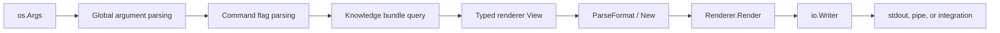

# Manly v1.1.0 Technical Architecture and Release Review

## Review scope

No external release checklist was provided. This review evaluates the current codebase against the v1.1.0 goals established for this change:

- `compact` is the default output format.
- `fancy` replaces `human`.
- Invalid formats list the available values.
- Each output format has isolated renderer logic.
- Renderers live in `internal/renderer` behind a standard interface.
- The knowledge layer remains independent from presentation.
- `show` supports multiple concept IDs and recursively loads concepts from directory arguments.

## Release summary

The v1.1.0 rendering architecture is implemented, including collection output for `show`. The dependency direction is clear:

```text
cmd/manly
  ├── internal/knowledge
  └── internal/renderer

internal/renderer
  └── Go standard library
```

`internal/renderer` does not import `internal/knowledge`. The command layer performs the domain query and maps domain objects into presentation views before rendering.

## Architecture

### Command layer: `cmd/manly`

Responsibilities:

- Parse global and command-specific arguments.
- Select the default format, currently `compact`.
- Load and query the knowledge bundle.
- Convert knowledge objects into renderer view models in `output_views.go`.
- Write renderer output to `os.Stdout`.

Important files:

- `cmd/manly/main.go`: command routing, global arguments, usage output.
- `cmd/manly/command_list_show.go`: list and show workflows.
- `cmd/manly/command_search.go`: search and context workflows.
- `cmd/manly/command_graph.go`: links, backlinks, and graph workflows.
- `cmd/manly/command_mutation.go`: mutations and validation workflow.
- `cmd/manly/render.go`: renderer package adapter and domain-to-view helpers.
- `cmd/manly/output_views.go`: typed view construction and renderer invocation.

### Knowledge layer: `internal/knowledge`

Responsibilities include:

- Load Markdown and YAML frontmatter.
- Resolve concept IDs and links.
- Select concepts under directories.
- Search concepts.
- Calculate backlinks and graph traversal.
- Mutate bundles.
- Validate bundles.

This layer does not know whether the caller wants compact, fancy, JSON, or Markdown output.

### Renderer layer: `internal/renderer`

The renderer package owns presentation behavior:

| File | Responsibility |
|---|---|
| `renderer.go` | `Format`, `Renderer`, format parsing, renderer factory, shared output helpers |
| `model.go` | Typed presentation views |
| `compact.go` | Minimal line-oriented output |
| `fancy.go` | Rich terminal output and navigation actions |
| `json.go` | Structured JSON output |
| `markdown.go` | Markdown output |

## Renderer contract

All format implementations satisfy the same interface:

```go
type Renderer interface {
    Format() Format
    Render(io.Writer, View) error
}
```

The `View` interface is sealed inside the renderer package. Supported typed views include:

- `ListView`
- `ShowView` for one concept
- `ShowResult` and `ShowCollectionView` for multiple concepts
- `SearchView`
- `ContextView`
- `LinksView`
- `BacklinksView`
- `GraphView`
- `CheckView`

The sealed view model prevents unrelated packages from introducing unsupported renderer input types while allowing `cmd/manly` to construct the defined view types.

Renderer selection is centralized:

```go
format, err := renderer.ParseFormat(value)
outputRenderer, err := renderer.New(format)
return outputRenderer.Render(os.Stdout, view)
```

Supported values are:

```text
compact, fancy, json, markdown
```

The removed `human` value is rejected:

```text
unsupported format "human"; available formats: compact, fancy, json, markdown
```

## End-to-end pipeline

A read-oriented command follows this flow:



Example for `manly search "external data"`:

1. `main.go` routes to `runSearch`.
2. `command_search.go` parses the query, filters, limit, and format.
3. `internal/knowledge.Search` returns domain search results.
4. `output_views.go` creates a `renderer.SearchView`.
5. `renderer.New` selects the requested format renderer.
6. The renderer writes the result to the supplied writer.

The same shape is used for list, show, context, links, backlinks, graph, and check. `show` first resolves each argument as a concept ID, then falls back to a recursive directory selection and renders a collection view when needed.

## Output behavior

| Command area | Compact | Fancy | JSON | Markdown |
|---|---|---|---|---|
| `list` | Aligned table: recursive lists use `ID`/`TITLE`; directory lists use `PATH`/`TITLE / CONCEPTS`, with `Details` or `List` footer hints respectively | Headings, descriptions, actions | Structured entries and actions | Markdown links |
| `show` | Single concept: ID and body; collections repeat the same blocks | Each concept includes body, links, backlinks, and actions | Single concept object or collection `results` array | One Markdown heading and body section per concept |
| `search` | Score, ID, title per line | Numbered results and actions | Scored result objects | Markdown list |
| `context` | ID and body | Context headings and actions | Structured context and links | Markdown sections |
| `links` | One link per line | Numbered navigable links | Link objects | Markdown links |
| `backlinks` | Source ID and label per line | Numbered source concepts | Backlink objects | Markdown links |
| `graph` | Depth, ID, title per line | Indented graph | Graph nodes | Markdown list |
| `check` | Tab-separated status lines | Human-readable diagnostics | Validation report | Markdown diagnostics |

`compact` is the default for commands that expose `--format`. `json` and `markdown` are representation formats; they do not inherit terminal styling from `compact` or `fancy`.

## Review findings

### Confirmed strengths

- Presentation code is separated from bundle loading and domain operations.
- Format parsing and supported-format errors are centralized.
- The `human` to `fancy` rename is enforced by parsing and tests.
- All supported output formats have dedicated implementation files.
- Renderers accept `io.Writer`, which supports stdout, pipes, and isolated renderer tests.
- Existing CLI and process-level workflows cover all four formats for the major read commands, including collection rendering for `show`.

### Known caveats for reviewers

1. Renderer write errors are currently ignored by the compact, fancy, and Markdown implementations because `fmt.Fprintf` and `fmt.Fprintln` return values are not checked. JSON encoding does propagate its encoder error. This is low risk for normal stdout usage but is a limitation of the `io.Writer` contract.
2. `internal/renderer` has no dedicated unit test files. The existing CLI tests exercise renderer selection and successful command execution, but they do not assert every exact output shape or simulate failing writers.
3. Each renderer uses a type switch over the supported view types. Adding a new view requires updating every format renderer. This keeps the public interface small, but the review checklist for a new command must include all format files.
4. The default `compact` value is declared in each command that supports `--format`, rather than in one shared command-option helper. A future format-capable command must explicitly adopt the compact default.
5. The repository does not currently embed an application version in `go.mod`, the CLI usage output, or a version command. The `v1.1.0` identity therefore remains a release tag and packaging concern rather than a runtime capability.

These caveats are documented for release review; no additional implementation changes are included in this review document.

## Release invariants

Reviewers should preserve these invariants when modifying the output system:

- `internal/knowledge` must not import `internal/renderer`.
- Renderer implementations must not query bundles or parse CLI arguments.
- New presentation data should be represented by a typed `View`.
- New commands must define behavior for `compact`, `fancy`, `json`, and `markdown`.
- Unsupported formats must list all available formats.
- Machine-oriented JSON output must remain structurally stable; single-concept `show` output remains unchanged while collections use a `results` array.
- The default terminal output must remain compact unless the CLI contract changes deliberately.

## Verification

The following checks passed during this documentation and implementation update:

```text
go build ./cmd/manly
git diff --check
```

Tests were not rerun after the collection-output changes. The repository contains CLI coverage for the new directory and multiple-ID `show` behavior, while `internal/renderer` currently has no dedicated test files. Runtime output snapshots for every command and format were not separately captured.
